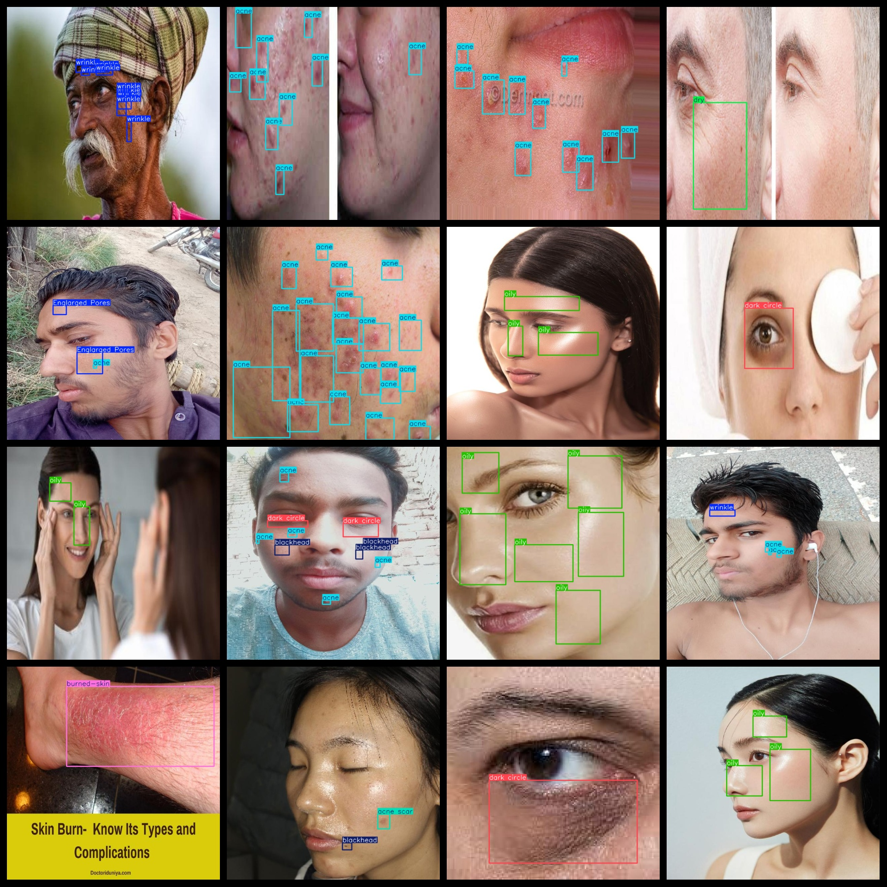
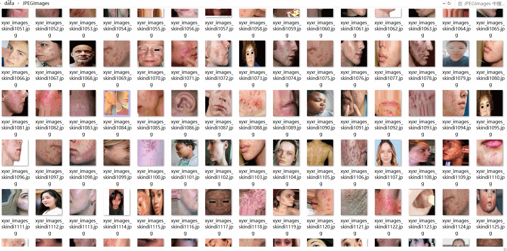

# Skin Disease Dataset 4530 imagesVOC+YOLO format

The skin disease dataset is 4530 images in VOC+YOLO format.

Dataset format: Pascal VOC format + YOLO format (the txt file does not contain the split path, it only contains jpg images and corresponding VOC format xml files and yolo format txt files)

Number of image files (jpg file count): 4530

Number of xml files: 4530

Number of annotations (number of txt files): 4530

Category count: 21

The Github repository is: datasets_sl

["Englarged Pores", "acne", "acne marks", "acne scar", "blackhead", "burned-skin", "dark circle", "darkspot", "dry", "freckle", "melasma", "nodules", "normal skin", "oily", "papules", "pores", "pustules", "skinredness", "vascular", "whitehead", "wrinkle"]

Pores enlargement, acne, acne scars, acne marks, acne lesions, burnt skin, dark circles, pigmentation spots, dryness, freckles, melasma, nodules, normal skin, oily, papules, pores, pustules, reddened skin, capillary, whitehead acne, wrinkles

Number of boxes labeled in each category:

Englarged Pores frame count = 657

Acne frame count = 19033

Acne marks = 72

Acne scar frame count = 822

blackhead frame count = 745

burned-skin frame count = 81

Dark circle count = 513

【】『』「」<>[] darkspot frame count = 124

Dry frame count = 2123

freckle frame count = 194

The number of melasma boxes = 2

nodules Frames = 208

Normal skin frames = 23

Oily frame number = 950

papules frame count = 618

pore_frames = 39

Pustules = 183

"skinredness" is a noun, which means "pinkness".

The number of vascular frames is 50.

Whitehead's box number = 636

wrinkle frame number = 2136

Total frames: 29,282

Number of images per category:

Enlarged Pores occupies 315 images.

Acne occupies 2428 pictures = 2428

Acne marks on pictures = 62

Acne scars count image = 232

Number of blackhead images = 372

Burned-skin occupancy of the image = 40

Dark Circles Occupy Pictures = 279

darkspot has 67 pictures

Dry occupies 638 pictures.

freckle annotated images = 105

Melasma has 2 images.

Nodules occupying the image count = 105

Normal skin occupies 23 images.

Oil-y's picture count = 335

Number of papules = 236

Pores occupancy = 36

Pustules occupancy = 78

Skin redness = 42

Vascular possession count = 27

Whitehead's possession of the image count = 199

Number of images owned = 293

Image resolution: 640x640

Use the labeling tool: labelImg

Dataset Augmentation: Yes

Rules for annotation: Draw a rectangle around the category.

Important note: The dataset does not have been divided into training, validation, and testing sets.

Special Disclaimer: This dataset does not guarantee the accuracy of the trained models or weight files.

Annotation and image details are as follows:

## Images

---

Here is a pay link on Stripe (https://buy.stripe.com/3cs8yP7sY87d0vu9AB). Please contact me lonlonago@foxmail.com after funding $89, and I will send you a complete data files, thank you!

